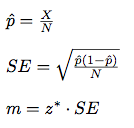

### A/B Testing of Scanner Experiment

### Experiment Design

All data and calculations are available for download from the git repository
[\[gitRepo\]][&gitRepo].

At the time of this experiment, Udacity courses had two options on the home page: "start free trial", and "access course materials". If the student clicks "start free trial", they will be asked to enter their credit card information, and then they will be enrolled in a free
trial for the paid version of the course. After 14 days, they will
automatically be charged unless they cancel first. If the student
clicks "access course materials", they will be able to view the videos and take the quizzes for free, but they will not receive coaching support or a verified certificate, and they will not submit their final project for feedback.

In the experiment, Udacity tested a change where if the student
clicked "start free trial", they were asked how much time they had
available to devote to the course. If the student indicated 5 or more
hours per week, they would be taken through the checkout process as
usual. If they indicated fewer than 5 hours per week, a message would
appear indicating that Udacity courses usually require a greater time
commitment for successful completion, and suggesting that the student
might like to access the course materials for free. At this point, the
student would have the option to continue enrolling in the free trial,
or access the course materials for free instead. [This
screenshot][&screenshot] shows what the experiment looks like.

The hypothesis was that this might set clearer expectations for
students upfront, thus reducing the number of frustrated students who
left the free trial because they didn't have enough time - without
significantly reducing the number of students to continue past the
free trial and eventually complete the course. If this hypothesis held
true, Udacity could improve the overall student experience and improve
coaches' capacity to support students who are likely to complete the
course.

The unit of diversion is a cookie, although if the student enrolls in
the free trial, they are tracked by user-id from that point
forward. The same user-id cannot enroll in the free trial twice. For
users that do not enroll, their user-id is not tracked in the
experiment, even if they were signed in when they visited the course
overview page.

### Metric Choice ###

Given a set of possible metrics, we first choose which ones to measure
for this experiment. Each mertic is either rejected or chosen as an
invariant metric or as an evaluation metric. The magnitude of
practical significance boundary for each metric dmin, i.e., the
difference that would have to be observed before it is a meaningful
change for the business, is given in parentheses. All practical
significance magnitudes are given as absolute changes.

Any place "unique cookies" are mentioned, the uniqueness is determined
by day. (That is, the same cookie visiting on different days would be
counted twice.) User-ids are automatically unique since the site does
not allow the same user-id to enroll twice.

#### Chosing Invariant Metrics

Since the following set of metrics measure quantities prior to the
screener, they can all be considered as invariant metrics between the
control and experiment groups:

* Number of cookies: That is, number of unique cookies to view the
  course overview page. (dmin=3000)

* Number of clicks: That is, number of unique cookies to click the
  "Start free trial" button (which happens before the free trial
  screener is trigger). (dmin=240)

* Click-through-probability: That is, number of unique cookies to
  click the "Start free trial" button divided by number of unique
  cookies to view the course overview page. (dmin=0.01)

#### Chosing Evaluation Metrics

The hypothesis indicates that the screener reduces the number of users
that actually enroll in the free trial, without significantly reducing
the number of users that continue past the free trial.

If the screener reduces free-trial enrollment, both the following two
metrics, gross conversion and retention, are expected to produce
significantly different values. While the value of the gross
conversion should decrease, the value of retention, should
increase. For each metric, the practical-significance margin,
dmin is indicated in parantheses.

* Gross conversion: That is, number of user-ids to complete checkout
  and enroll in the free trial divided by number of unique cookies to
  click the "Start free trial" button. (dmin= 0.01)

* Retention: That is, number of user-ids to remain enrolled past the
  14-day boundary (and thus make at least one payment) divided by
  number of user-ids to complete checkout. (dmin=0.01)

Although both metrics measure the same effect, we would want to
eventually settle on a single metric because composite metrics are
tricky and hard to agree on. While gross conversion uses "cookies to
click" as unit of diversion, retention uses "users to enroll", which
is a much larger unit. Therefore, to detect the same minimum effect
(dmin) of 0.1, the retention metric will probably require more
statistical power than gross conversion. We will know more about this
in later sections after we have performed some more calculations.

A separate metric is needed to test that the screener does not
significantly reduce the number of users that continue past the free
trial and pay. The following metric is expected to produce similar
values within bounds of statistical variability.

* Net conversion: That is, number of user-ids to remain enrolled past
  the 14-day boundary (and thus make at least one payment) divided by
  the number of unique cookies to click the "Start free trial"
  button. (dmin= 0.0075)

Note that even though the following metric is affected by the screener
we chose not to include it for reasons explained below.

* Number of user-ids: That is, number of users who enroll in the free
  trial. (dmin=50)

Since the experiment uses number of cookies as unit of diversion it is
hard to ensure that the experiment and control groups contain similar
number of users. Therefore, the above metric is not well defined; even
if enrollment goes down, we cannot tell if the difference is caused
due to the screener or due to a smaller number of users in the
experiment group.

### Measuring Standard Deviation

The previous section chose the invariant and evaluation metrics for
the experiment. Now we make sure that the evaluation metrics do not
have too much variability to be appropriate for the experiment. 

For this we make analytical estimates of the standard deviation from a
sample of the following historical data collected prior to experiment.

| Metric | Value |
|--------|---------|
| Unique cookies to view page per day | 40000 |
| Unique cookies to click "Start Free Trial" button per day | 3200 |
| Enrollments per day | 660 |
| Click Through Probability (CTP) on "Start Free Trial" | 0.08 |
| Probability of enrolling, given click (Gross Conversion) | 0.20626 |
| Probability of payment, given enroll (Retention) | 0.53 |
| Probability of payment, given click (Net Conversion) | 0.1093125 |

From a smaple size of 5000 cookies visiting the course overview page,
we compute the estimated probability p^, and then use it to
compute the Standard Error (SE), which is an estimate the Standard
Deviation [&stddevrblog], using the following formula

In the above formula the sample size N is measured in units of
analysis which is different for different metrics:

1. For gross and net conversion, unit of analysis is the number of
pageviews, and there are 400 (3200 x 5000 / 40000) units in the
sample. For N=5000, the standard deviations of gross conversion and
net conversion are 0.0202 and 0.156 respectively.

2. For retention, unit of analysis is the number of enrollments, and
there are 82.5 (660 x 5000 / 40000) units in the sample. For N=82.5,
the standard deviation of retention is 0.53.

The analytical estimates of variance presented above assume that the
underlying data for each metric follow Binomial Distribution. This
assumption holds because all the evaluation metrics measure success
probabilities of two-outome events, where events are independent and
have identical probability distributions. Additionally the sample size
and probabilities in each case also satisfy the Normal approximation
condition: Np^ > 5 and N(1-p^)>5.

Although, under ideal conditions, analytical variability estimates of
gross conversion and retention metrics are valid, they can
significantly underestimate the empirical variance when the experiment
system is less than ideal and has issues regarding randomization,
bias, or population effects etc. In such cases, it is safer to perform
A vs A experiments as a sanity check for the experiment system. A vs A
experiments require more effort that involves either hundreds of A vs
A tests, or a really large A vs A test, or the use of bootstrapping
techniques etc.

For more complicated metrics such a median or ratios, the
distributions cannot be assumed to be Binomial. In such cases
analytical estimates vastly underestimate empirical variability, and
should not be used.

### Sizing

#### Number of Samples vs. Power

Even if the changes in the evaluation metrics are found to be
substantive as per their magnitudes of practical significance
dmin, they are not repeatable unless they are statistically
significant. This section discusses how to determine the sample size,
the number of pageviews in the control and the experiment groups,
needed to achieve a statistically significant change in each metric.

To be statistcally significant, changes need to safeguard against two
types of variability effects:

1. they are detected even though they didn't not actually exist; this
is measured with *confidence-level* 1-&alpha;, where &alpha; is the
probability of false positives.

2. they were not detected even though they did exist; this is measured
with *sensitivity* 1-&beta;, where &beta; is the probabilty of false
negatives.

The sample size must be large enough to provide the statistical power
so that each metric has adequate confidence level and sensitivity. The
required sample size goes up with decreasing values of &alpha;,
&beta;, and dmin, and goes down with baseline probability
moving farther away from 0.5.

For an &alpha; of 0.05 and a &beta; of 0.2, the sample size for enough
statistical power can be determined as follows.

1. Use this [online sample size calculator][&onlinecalc] to get the
sample size of one group in the unit of analysis of the corresponding
metric.

2. Since we need two samples, one for control and one for experiment,
multiply the result with 2

3. Express all the quantities in pageviews using the following rule.
  * clicks to pageviews: multiply by 40000/3200
  * enrolls to pageviews: mulitply by 40000/660

4. Take the maximum numer of pageviews over all the metrics.

Combining multiple metrics increases the probability of false
positives, because any metric producing a false positive causes the
combined metric to produce a false positive. A coservative approach is
to apply the Bonferroni correction (divide &alpha; by the number of
metrics) while sizing. However, since the metrics are highly
correlated, the Bonferroni method would have been too
conservative. Hence we avoided the Bobferroni correction.

| Metric | Baseline | dmin|Size in Unit of Analysis | Size in Unit of diversion |
|--------|---------|-----------------|---------------------------|---------------------------|
| Probability of enrolling, given click (Gross Conversion) | 0.20626 | 1% | 51670 | 645845 |
| Probability of payment, given enroll (Retention) | 0.53 | 1% | 78230 | 4741212 |
| Probability of payment, given click (Net Conversion) | 0.1093125 | 0.75% | 54826 | 685325 |

Since the retention metric uses number of enrollments as units of
analysis, its sample size really grows up after converting it to
pageviews. This makes retention a little more challenging as a metric,
because it will need a fair amount of user data to make that work.  At
this point it is just not really realistic.  It's going to take a very
long time to get that much data, it's a big investment. We would
rather retention from our list of retention metrics, because we will
still have two other metrics to work with.

After dropping retention, the take the largest of the pageview numbers
of the remaining metrics, 685325, and the number of pageviews needed
for our experiment.

#### Duration vs. Exposure

Assuming there are no other experiments going on, it is safe to divert
the entire traffic to this experiment becasue the experiment does not
collect any private data, and does not leave any permanent
footprint. Hence we chose to divert 100% of the traffic to this
experiment.

At the rate of 40000 page view per day, it will require 18 days to
collect 685325 page views from 100% of the traffic. This is a
reasonable duration for an experiment without much risk to Udacity.

## Experiment Analysis

The data to analyze is given in a spread sheet available from
repository [\[gitRepo\]][&gitRepo]. This data contains the raw
information needed to compute the above metrics, broken down day by
day. Note that there are two sheets within the spreadsheet - one for
the experiment group, and one for the control group.

The meaning of each column is:

Pageviews: Number of unique cookies to view the course overview page that day.

Clicks: Number of unique cookies to click the course overview page that day.

Enrollments: Number of user-ids to enroll in the free trial that day.

Payments: Number of user-ids who who enrolled on that day to remain
enrolled for 14 days and thus make a payment. (Note that the date for
this column is the start date, that is, the date of enrollment, rather
than the date of the payment. The payment happened 14 days
later. Because of this, the enrollments and payments are tracked for
14 fewer days than the other columns.)

### Sanity Checks

Before looking at click-through probabilities to determine what
happened in the experiment, we have to do some sanity checks to ensure
that the experiment was run properly.

The total nmber of clicks from Oct 11 thru Nov 16 of the invariant
metrics are shown below. We start by checking whether the total values
invariant metrics are equivalent between the two groups; if they are
not found to be equivalent then we can look more closely into the
day-by-day data.

| Metric | Control | Experiment | Pool | 
|--------|---------|------------|------|
| Number of cookies | 345543 | 344660 | 690203 | 
| Number of cookies to click "Start Free Trial" | 28378 | 28325 | 56703 |
| Click Through Probability (CTP) on "Start Free Trial" | 0.0821| 0.0822 | 0.0822 |

The first two metrics, number of cookies and number of clicks, are
populatin sizing metrics that should be randomly split between the 2
groups. So we can use a Binomial test that constructs a Binomial
confidence interval at 95% confidence level as follows:

1. compute the standard deviation of a binomial distribution with
probability 0.5 of success (being assigned to the control group)

2. multiply the standard deviation by the z-score 1.96 of our chosen
confidence level of 95% to get the margin of error

3. compute a confidence interval around 0.5 as [0.5-m, 0.5+m] - this
is the range within which the observed fraction of cookies should fall
if the experiment was run properly.

4. compute the observed fraction of successes (cookies in the control
group) and check whether this value falls within this confidence
interval.

The third invariant metric, click through probability, we calculate
the confidence interval for a difference in proportions between
experiment and control as follows

1. compute the pooled statndard error of the difference in proportions
using the pooled probability of clicks (total probability across
control and experiment groups)

2. multiply the standard error by the z-score 1.96 of our chosen
confidence level of 95% to get the margin of error

3. compute a confidence interval around 0 as [-m, m] - this is the
range within which the observed difference of proportions should fall
if the experiment was run properly.

4. compute the difference in proportions between experiment and
control and check whether this value falls within this confidence
interval.

| Metric | SD | m | Lower Bound | Upper Bound | Observed | Passes|
|--------|----|---|-------------|-------------|----------|-------|
| Number of cookies | 0.0006 | 0.0012 | 0.4988 | 0.5011 | 0.5006 | Yes |
| Number of cookies to click "Start Free Trial" | 0.0021 | 0.00412 | 0.49588 | 0.50412 | 0.5005 | Yes |
| Click Through Probability (CTP) on "Start Free Trial" | 0.0007| 0.0013 | -0.0013 | 0.0013 | 0.0001 | Yes |

Since all the observed fractions and proportions fall within their
confidence intervals, we can conclude that the experiment was run
properly. Otherwise, we would look at the day by day data again and
check whether any particular day stands out as causing the problem or
whether it seems to be an overall pattern. Once we distinguish between
an overall problem or a problem on a specific day, we can discuss with
engineering what could have gone wrong. Another approach is to try
slicing. For example, by country, language or platform to see if one
particular slice looks like it's causing the problem or you could
check the age of the cookies in each group. Does one group tend to
have more new cookies while the other group has older cookies or
something like that.

### Result Analysis

#### Effect Size Tests

After passing the sanity checks and making sure the experiment was set
up properly, the evaluation metrics are checked for the magnitude of
the effects. The goal is to determine if the effects are statistically
and practically significant. If the effect is not statistically
significant then it may not be repeatable, and if the effect is not
practically significant then it may not serve any business objective.

We observe the difference between the experiment and control groups,
and then compute a 95% confidence interval around it as follows:

1. compute the pooled statndard error of the difference in
probabilities using the pooled probability of clicks (total
probability across control and experiment groups). Since we are
dealing with click through probabilities, we assume a binomial
distribution

2. multiply the standard error by the z-score 1.96 of our chosen
confidence level of 95% to get the margin of error

3. compute a confidence interval around the observed difference
d^ as [d^-m, d^+m]

A metric is statistically significant if the confidence interval does
not include 0 (we can be confident there was a change), and it is
practically significant if the confidence interval does not overlap
with the practical significance interval [-dmin,
dmin] (we can be confident there is a change that matters
to the business.)

Although we have two evaluation metrics, we expect to see a change in
one of them, and no change in the other. Combining these metrics does
not necessarily increase the probability of false positives of the
combined metrics, therefore we avoided the Bobferroni correction.

The following table summarizes the results. Here we note that although
the data was collected from Oct 11 through Nov 16, the evaluation
metrics data was only available until Nov 2. Hence the probability
estimates were calculated using data till Nov 2, and the data from Nov
3-16 were not used in these calculations.

| Metric | Exp-Control | m | Lower | Upper |  dmin | SSig | PSig |  
|--------|-------------|---|-------|-------|------------------|------|------|
| Gross Conversion | -0.0206 | 0.00086 | -0.0291 | -0.0120 | | 0.1 | Y,Y |
| Net Conversion | -0.0049 | 0.0067 | -0.0116 | 0.0119 | 0.1 | N,N|

#### Sign Tests

In this section we cross check our results with other methods. For
example, we can use non-parametric sign tests to compare the results
to what you got from the parametric hypothesis test presented in
the previous section.

To do a sign test for gross conversion, we need to know the number of
days, which in this case is 23, and the number of days with a negative
change.  So comparing the probabilities of enrolling each day, we can
see that the experiment group actually had a lower enrolling probability
on 19 days.  This certainly looks good for the experiment, but
what will be the chance of this happening randomly?

So the question is if you flip a fair coin 23 times, what is the
chance it comes up heads 19 times ? Here the number of days is high
enough for the binomial to approximate a normal distribution
(Np^ > 5 and N(1-p^)>5). However, we can also
use the online calculator at [\[quickcalcs\]][&quickcalcs] to compute
the two-tailed P value for probability density of the binomial
distribution as 0.0026. That's the probability of observing a result
at least this extreme by chance.  Since this is less than the chosen
&alpha; of 0.05, the sign test agrees with the hypothesis test, that
this result was unlikely to come about by chance.

The two tailed P value of the for net conversion can be similarly
computed to be 0.6776. This is the probability of observing a result
at least this extreme by chance. Since this is much higher than the
chose &alpha; of 0.5, we have to assume that the slight difference in
the number of days with positive and negative chnages is caused by
pure chance, and we expect the probability net convertion to be the
same between the control and the experiment groups.

All the sign-test results over 23 days are summarized in the following table. 

| Metric | Days with Positive Outcome | p-value | Statistically Signifiant | 
|--------|----------------------------|---------|--------------------------|
| Gross Conversion | 19 | 0.0026 | Yes |
| Net Conversion   | 13 | 0.6776 | No | 

#### Summary

We have designed and performed an experiment to check the effect of
adding a screener before letting the users start a free trial. A
cookie was used as the unit of diversion. We started with properly
chosing a set of invariant metrics, and a set of evaluation metrics,
and . , checked their variability. We sized the experiment to have
enough statistical power for &alpha;=0.5 and &beta;=0.2, and
determined that the experiement can be performend on the entire
traffic over a duration of about 18 days. We did a sanity check on the
results and found that the invariant metrics resutls are comparable
between the two groups. We also found that although the experiment
group showed a statistically and practically significant reduction in
the gross conversion rate, there was no significant change in the net
conversion rate. Even though we used both gross and net conversions as
evaluation metrics, we did not use the Bonferroni correction, becuase
these metrics are highly correlated. Since a sign test on the
day-by-day data agree with the hypothesis test, this result was
unlikely to come about by chance.

### Recommendation

We understand that the free-trial screener might set clearer
expectations for students upfront and reduce the number of frustrated
students who left the free trial because they didn't have enough time
to commit to the course.

Results of our experiment are both statistically and practically
significant on all metrics. Additional sign test on the day-by-day
data agrees with the hypothesis test, so these results are unlikely to
occur by chance. This gives us increased confidence in the experiment
results.

At the end it is not just about statistical evidence; the end goal is
to actually make recommendation that demonstrates our judgment with
regards to the user experience and the business. What if this change
has a positive impact on one slice of users, but then, for another
slice, there's no impact or there's a negative impact? What's the
engineering cost of maintaining the change ? Are there customer
support or sales issues? Overall what's the opportunity cost if you
actually choose to launch the change ? Since we are simply adding an
extra screener for all users, we don't expect any unusual impact on a
specific slice of users, and neither do we expect a high deployment
cost.

Although the initial effect is statically significant, they can
disappear due to *learning effects* when the users start adapting to a
change or not. When users first see a change, they tend to react in
one of these two ways causing two different types of effects: *change
aversion*, when users first see a change and don't like it, *novelty
effect* which is the exact opposite. In particular, we need to worry
about change aversion, i.e. users simply want to get past this screen
and trivially put in a number > 5 to get past the screener and enroll
anyway. Measuring such learning effects require cohort analysis with
varying time and dosage.

In the next section we suggest a more sophisticated follow-up
experiment that will guard against such learning effects.

## Follow-Up Experiment

The previous section described how the effects of teh current
experiment may plateu over time due to learning effects. Fortunately,
it is possible to design other experiments with the same goal of
reducing the early cancellations while not affecting the invariant
metrics. For example, users can be given a spot quiz on basic skills
before taking them through the checkout process. This is a more
expensive experiment, because unlike the current screener test, the
spot quizes may have to be different for different courses.

The hypothesis is that selects a more fit set of students upfront,
thus reducing the number of frustrated students who left the free
trial because they didn't have enough requisite skill - without
significantly reducing the number of students to continue past the
free trial and eventually complete the course. A cookie will be used
as the unit of diversion, and the same set of invariant and evaluation
metrics as the current experiement can be used. However, this being a
more agressive experiment, we can chose a larger magnitude of
practical significance boundary; e.g. dmin=0.125.

### References

[\[gitRepo\] A/B Test Free Trial Screener][&gitRepo]

[\[screenshot\] Screen Shot of Screener][&screenshot]

[\[onlinecalc\] How many subjects are needed for an A/B test ?][&onlinecalc]

[\[graphcalc\] QuickCalcs: Sign and Binomial Test] [&graphcalc]

[\[stddevrblog\]: Standard Deviation vs Standard Error] [&stddevrblog]

[&gitRepo]: https://github.com/samitchaudhuri/ab-test-screener "A/B Test Free Trial Screener"
[&screenshot]: https://drive.google.com/file/d/0ByAfiG8HpNUMakVrS0s4cGN2TjQ/view "Screen Shot of Screener"
[&onlinecalc]: http://www.evanmiller.org/ab-testing/sample-size.html "How many subjects are needed for an A/B test ?"
[&graphcalc]: http://graphpad.com/quickcalcs/binomial1.cfm "QuickCalcs: Sign and Binomial Test"
[&stddevrblog]: https://www.r-bloggers.com/standard-deviation-vs-standard-error/ "Standard Deviation vs Standard Error"

